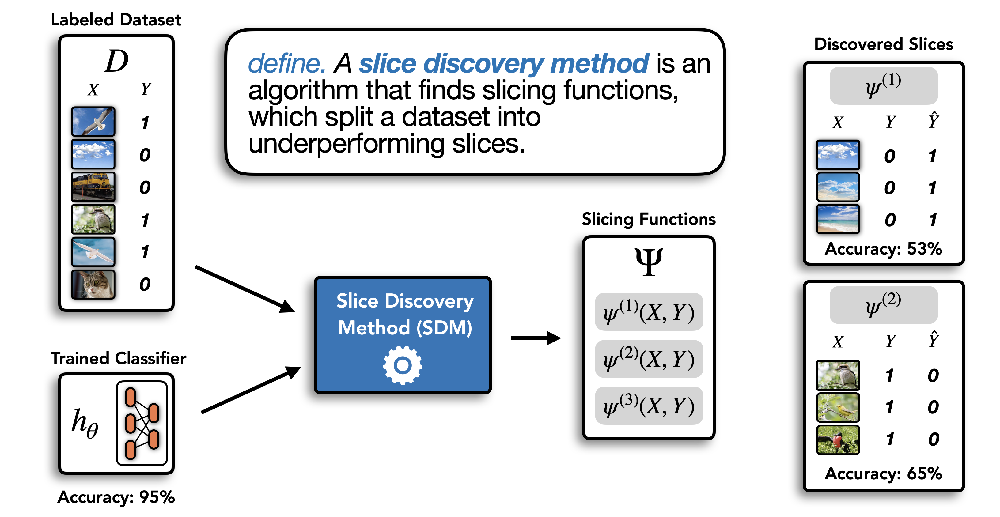

<div align="center">
    <!---
    
    -->
Domino 

<!---


[](https://dcbench.readthedocs.io/en/latest/?badge=latest)
[](https://github.com/pre-commit/pre-commit)
[](https://pypi.org/project/dcbench/)
[](https://codecov.io/gh/HazyResearch/domino)
-->
Discover slices of data on which your models underperform. 

[**Getting Started**](#%EF%B8%8F-quickstart)
| [**What is domino?**](#-what-is-domino)
| [**Docs**](https://domino-slice.readthedocs.io/en/latest/index.html)
| [**Contributing**](CONTRIBUTING.md)
| [**Paper**](https://arxiv.org/abs/2203.14960.pdf)
| [**About**](#%EF%B8%8F-about)
</div>


## ⚡️ Quickstart

```bash
pip install "domino[clip,text] @ git+https://github.com/HazyResearch/domino@main"
```
> For more detailed installation instructions, see the [docs](https://domino-slice.readthedocs.io/en/latest/intro.html).

```python
import domino
```

To learn more follow along in our tutorial on [Google Colab](https://colab.research.google.com/github/HazyResearch/domino/blob/main/examples/01_intro.ipynb) or dive into the [docs](https://domino-slice.readthedocs.io/en/latest/intro.html). 


## 🍕 What is Domino?

Machine learning models that achieve high overall accuracy often make systematic errors on coherent slices of validation data. Domino provides tools to help discover these slices.

***What is a slice?***  A slice is a set of data samples that share a common characteristic. As an example, in large image datasets, photos of vintage cars comprise a slice (i.e. all images in the slice share a common subject). The term slice has a number of synonyms  that you might be more familiar with (e.g. subgroup, subpopulation, stratum).

Slice discovery is the task of mining unstructured input data (e.g. images, videos, audio) for semantically meaningful subgroups on which a model performs poorly. We refer to automated techniques that mine input data for semantically meaningful slices as slice discovery methods (SDM). Given a labeled validation dataset and a trained classifier, an SDM computes a set of slicing functions that partition the dataset into slices. This process is illustrated below. 



This repository is named `domino` in reference to the pizza chain of the same name, known for its reliable slice deliveries. It is a slice discovery hub that provides implementations of popular slice discovery methods under a common API. It also provides tools for running quantative evaluations of slice discovery methods. 

To see a full list of implemented methods, see the [docs](https://domino-slice.readthedocs.io/en/latest/apidocs/index.html). 
## 🔗 Useful Links
- 💻 [GitHub](https://github.com/HazyResearch/domino)
- 📘 [Docs](https://domino-slice.readthedocs.io/en/latest/)

Papers:
- 📄 [ICLR 2022 Paper](https://arxiv.org/abs/2203.14960)

Blogposts:
- 🌍 [BlogPost](https://hazyresearch.stanford.edu/blog/2022-04-02-domino)


## ✉️ About
Reach out to Sabri Eyuboglu (eyuboglu [at] stanford [dot] edu) if you would like to get involved or contribute!
